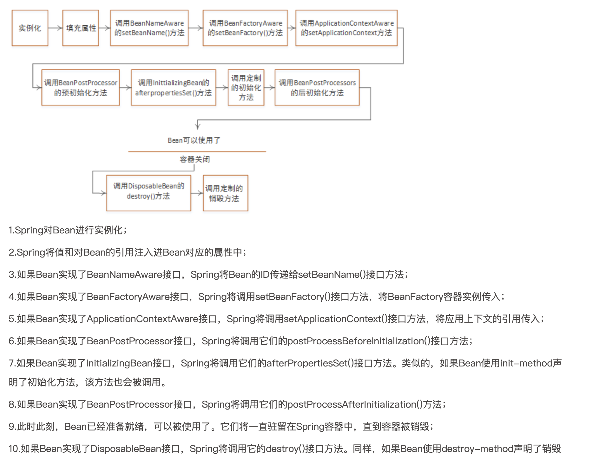

Spring 记录笔记

### 接口返回改变状态码

```java
// ResponseEntity 也可以让它作为返回值
@GetMapping("test2")
@ResponseStatus(HttpStatus.CREATED)
public RetUtil<UserDemo> test2(@Valid UserDemo userDemo) {
    return RetUtil.success(userDemo);
}
```

### Bean 的装配
- 使用 @Component 派生别的注解
- 使用 @import 导入配置类，或实现了 ImportSelector的类
- SpringFactoriesLoader 加载类添加到 ApplicationContext

### Spring Bean 加载
[图片来源](https://mrbird.cc/Spring-Bean%E7%94%9F%E5%91%BD%E5%91%A8%E6%9C%9F.html)



### SpringBoot 结合 IDEA 切换激活环境 
